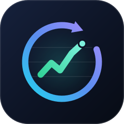
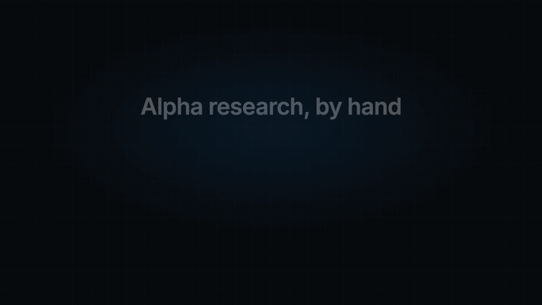
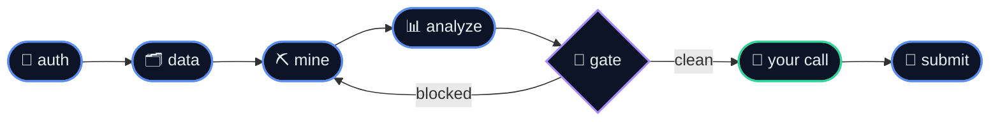

<div align="center">



<h1>worldquant-orchestrator</h1>

<p>
  <b>End-to-end control of <a href="https://platform.worldquantbrain.com">WorldQuant BRAIN</a> from any coding agent.</b><br>
  Data discovery → alpha generation → backtesting → analysis → submission,<br>
  driven through BRAIN's official REST API rather than the web UI.
</p>

<p>
  <a href="https://www.python.org/downloads/"></a>
  <a href="https://github.com/aaditya-v-more/worldquant-orchestrator/actions/workflows/tests.yml"></a>
  <a href="LICENSE"></a>
  
  <a href="https://github.com/aaditya-v-more/worldquant-orchestrator/stargazers"></a>
</p>

<p>
  <a href="https://platform.worldquantbrain.com"></a>
  
  
  
</p>

<p>
  <a href="#-quick-start"><b>Quick start</b></a> ·
  <a href="https://skills.sh/aaditya-v-more/worldquant-orchestrator/wqo-cli"><b>Install skills on skills.sh</b></a> ·
  <a href="#-the-loop"><b>The loop</b></a> ·
  <a href="#-commands"><b>Commands</b></a> ·
  <a href="#-simulation-settings"><b>Settings</b></a> ·
  <a href="#-safety-model"><b>Safety</b></a> ·
  <a href="#-rate-limiting"><b>Rate limiting</b></a> ·
  <a href="#-reference"><b>Docs</b></a>
</p>

<br>



<p><sub><b>Synthetic demonstration.</b> All expressions, identifiers and results shown are illustrative;<br>this is not a live account recording or evidence of investment performance.<br>
<a href="docs/media/demo.mp4">Full-resolution video →</a> · <a href="docs/demo.md">Synthetic walkthrough →</a></sub></p>

</div>

---

## ✦ Two layers

<table>
<tr>
<td width="50%" valign="top">

### 🐍 &nbsp;`wqo/` — the client

A Python library and CLI for BRAIN's REST API. Authentication, pacing, a SQLite
audit ledger, backtesting, gating, mining. **Usable entirely on its own** — no
agent required.

</td>
<td width="50%" valign="top">

### 🤖 &nbsp;`skills/` — portable agent skills

A core `wqo-cli` skill and eight companions teach agents how to use the client.
Each installs missing WQO locally and works without a repository checkout.
Install through `npx skills` for your supported agents.

</td>
</tr>
</table>

---

## 🔄 The loop



| Stage | Skill | What it does |
|---|---|---|
| 🔑 | [`wqo-auth`](skills/wqo-auth) | Session, quotas, level, biometric handoff |
| 🗂️ | [`wqo-data`](skills/wqo-data) | Datasets, datafields, operators — cached 7 days |
| ⛏️ | [`wqo-mine`](skills/wqo-mine) | Generate candidates, backtest in batch, rank survivors |
| 🔬 | [`wqo-simulate`](skills/wqo-simulate) | One expression, or a sweep over settings and fields |
| 📊 | [`wqo-analyze`](skills/wqo-analyze) | IS stats, PnL, yearly breakdown, correlations, checks |
| 🏷️ | [`wqo-alphas`](skills/wqo-alphas) | Filter and organize the library — names, tags, colours |
| 🚀 | [`wqo-submit`](skills/wqo-submit) | Full check report, then waits for your explicit yes |
| 🏆 | [`wqo-account`](skills/wqo-account) | Rank, competitions, teams, events, standing |

---

## ⚡ Quick start

Use macOS or Linux. Choose either route; neither requires a manual clone.

**CLI:** [install uv](https://docs.astral.sh/uv/getting-started/installation/),
then install [WQO from PyPI](https://pypi.org/project/wqo/). uv can provision Python 3.12.

```bash
uv tool install --python 3.12 wqo
wqo --version
wqo state
```

**Agent skill:** with [Node.js/npm](https://nodejs.org/en/download) and uv (or
Python 3.12+) available, run from your working project:

```bash
npx skills add aaditya-v-more/worldquant-orchestrator --skill wqo-cli
```

Select your agent and keep the install project-local (omit `--global`). Invoke
`wqo-cli` in your agent; its runner installs missing WQO into `.wqo/venv`.
Ask it to show the version and state paths first. See [skill setup](docs/skills.md)
for the runner path; a skill-local install does not put `wqo` on your shell PATH.
The commands below use the CLI route; agents run them through the skill runner.

You need your own [BRAIN account](https://platform.worldquantbrain.com) for live
operations. Create `~/.brain_credentials.json` yourself in a text editor.
Use this JSON format and keep the password out of shell history and chat:

```json
{"email": "you@example.com", "password": "..."}
```

```bash
chmod 600 ~/.brain_credentials.json
```

Then:

```bash
wqo auth status
```

> [!IMPORTANT]
> **Persona verification.** If authentication exits with code `2` and provides
> an inquiry URL, open it in your browser and complete the check yourself, then
> run `wqo auth persona`. Other authentication errors also use exit `2`; follow
> the actual error message. An agent must wait for you to confirm completion.

A synthetic example expression (no claimed performance) is `rank(close)`.
To backtest it after authentication:

```bash
wqo sim run --code "rank(close)" --neutralization NONE --test-period 1y
```

This sends the expression and settings to BRAIN and uses simulation quota. It
creates a backtest, not a submission; results do not guarantee future returns.
For a check without BRAIN access or research quota, use `wqo sim run --help`.
See [installation and onboarding](docs/installation.md) for credential setup,
PATH troubleshooting, upgrades and existing-ledger migration. Contributors use
[the clone/venv setup](CONTRIBUTING.md#getting-set-up).

---

## 🛠 Commands

Everything prints JSON to stdout. `gate` and `submit` also render a table unless
`--json` is passed. The reference below uses `|` for alternatives, `[]` for
optional arguments and `<alpha_id>` for your identifier; these are notation,
not shell pipelines. Use `wqo <command> --help` for copyable argument syntax.

```text
# ── account ─────────────────────────────────────────────────────────
wqo auth login | status | persona | logout

# ── data discovery (locally cached for 7 days) ──────────────────────
wqo data datasets --region USA --delay 1 --universe TOP3000
wqo data fields --dataset fundamental6 --search revenue
wqo data operators

# ── backtesting ─────────────────────────────────────────────────────
wqo sim run --code "-ts_delta(ts_backfill(close, 60), 5)"
wqo sim run --code "rank(close)" --neutralization NONE --test-period 1y
wqo sim batch --file ideas.json
wqo sim recent

# ── analysis ────────────────────────────────────────────────────────
wqo alpha get|pnl|yearly <alpha_id>
wqo alpha corr <alpha_id> [--prod]
wqo alpha list --status UNSUBMITTED --min-sharpe 1.25
wqo alpha list --grade EXCELLENT
wqo alpha tag <alpha_id> --name "..." --color GREEN --tags a,b

# ── submission ──────────────────────────────────────────────────────
wqo gate <alpha_id>              # read-only report
wqo submit <alpha_id>            # report only, refuses to submit
wqo submit <alpha_id> --confirm  # actually submits

# ── mining ──────────────────────────────────────────────────────────
wqo mine --dataset fundamental6 --budget 40 [--dry-run]

# ── competitions, standing, team, learn, notifications ──────────────
wqo account status                    # rank, score, level progress
wqo account competitions [--mine]
wqo account competition IQC2026S1 [--alphas|--agreement]
wqo account activity                  # counters + referrals
wqo account teams|events|tutorials|messages|agreements
wqo account probe                     # what this level can reach

# ── anything not wrapped above ──────────────────────────────────────
wqo api GET /users/self/activities
wqo discover
```

WQO 0.1.1+ also provides `wqo account snapshot` to write dated, private
`ACCOUNT.local.md` notes in the current directory. Existing notes are preserved;
use `--overwrite` to refresh. See [the changelog](CHANGELOG.md).

<table>
<tr>
<th align="left">Exit code</th><th align="left">Meaning</th>
</tr>
<tr><td><code>0</code></td><td>success</td></tr>
<tr><td><code>1</code></td><td>generic error, or gate blocked</td></tr>
<tr><td><code>2</code></td><td>auth required / biometric pending</td></tr>
<tr><td><code>3</code></td><td>daily budget exhausted</td></tr>
<tr><td><code>4</code></td><td>submission refused</td></tr>
</table>

---

## ⚙️ Simulation settings

Every field the web UI's settings panel exposes is a flag on `sim run`,
`sim batch` and `mine`, defaulting to `DEFAULT_SETTINGS` in
[`wqo/config.py`](wqo/config.py):

| UI field | Flag | Default |
|---|---|---|
| Language | *fixed* — `FASTEXPR` | |
| Instrument Type | `--instrument-type` | `EQUITY` |
| Region | `--region` | `USA` |
| Universe | `--universe` | `TOP3000` |
| Delay | `--delay` | `1` |
| Neutralization | `--neutralization` | `SUBINDUSTRY` |
| Decay | `--decay` | `6` |
| Truncation | `--truncation` | `0.08` |
| Pasteurization | `--pasteurization` | `ON` |
| Unit Handling | `--unit-handling` | `VERIFY` |
| Nan Handling | `--nan-handling` | `OFF` |
| Test period | `--test-period` | none (`P0Y0M`) |

`--test-period` takes `1y`, `6m`, `1y6m` or the ISO form `P1Y6M`; anything else
is rejected rather than silently backtesting over the wrong window.

> [!NOTE]
> On `mine`, `--decay` and `--truncation` are unset by default so each template
> runs under the regime it declares (`config.REGIMES`). Pass them to pin one
> knob, or `--neutralizations` to sweep — a sweep multiplies jobs without adding
> expressions, and `--budget` caps the total.

---

## 🏅 Alpha grade

Alpha records carry a `grade` BRAIN computes itself:

<div align="center">

 ▸
 ▸
 ▸
 ▸


</div>

It comes free on the record, so `sim run`, `mine` and `gate` all report it, and
`alpha list --grade EXCELLENT` filters on it. It is read-only and purely
informational — `is.checks` plus the local thresholds are what decide whether an
alpha may be submitted.

---

## 🔒 Safety model

> [!WARNING]
> **Submission is the only irreversible action, and it is deliberately awkward.**
> It consumes a daily quota of 3 and permanently affects future self-correlation.

- `submit` without `--confirm` **cannot** submit. It prints the check report and
  exits `4`.
- With `--confirm` but a failing gate, it still refuses unless `--force`.
- Submission quota is reserved atomically before the request; unresolved writes
  retain their reservation and cannot be retried through `submit`.
- Raw `api` is read-only. Writes are never automatically replayed.
- Processes sharing one ledger share simulation slots and quota accounting.

See [safety controls and limits](docs/safety.md), including the conservative
submission window and how to handle uncertain outcomes.

Credentials are read directly from disk into HTTP Basic auth. They are never
logged, echoed, or written by this tool.

---

## 📡 Rate limiting

WQO paces requests to BRAIN's API using these controls:

- **`Retry-After` governs read retries and polling**, including simulation progress,
  checks and correlations. A throttled write stops without an automatic replay.
- Minimum interval plus jitter between all requests.
- Exponential backoff with full jitter on read requests receiving 429/5xx.
- **Concurrency is *learned* from the account:** it starts at 1 slot, grows only
  after clean runs, and shrinks immediately on a 429. Persisted between runs.
- The session cookie is cached on disk and reused. Re-authenticating on every
  invocation is both slow and the most abnormal traffic pattern a client can
  produce.
- Local daily budgets on simulations and submissions.

Tunable via environment variables — `WQO_MIN_INTERVAL`, `WQO_JITTER`,
`WQO_SIM_BUDGET`, `WQO_SUBMIT_BUDGET`, `WQO_MAX_CONCURRENCY`, and the
`WQO_MIN_SHARPE` / `WQO_MAX_TURNOVER` style gate thresholds. See
[`wqo/config.py`](wqo/config.py).

---

## 🧩 Editor support

Install skills from your working project:

```bash
npx skills add aaditya-v-more/worldquant-orchestrator --skill wqo-cli
```

Choose your agents in the installer; omit `--global` to keep installation local.
Use `--skill '*'` for all nine skills. Each companion works alone and installs
missing WQO into the project's `.wqo/venv`.

Source packages live in `skills/`; installed agent folders are gitignored.
See [portable skills and local installation](docs/skills.md) or
[the core skill on skills.sh](https://skills.sh/aaditya-v-more/worldquant-orchestrator/wqo-cli).

---

## 📚 Reference

**Agents start here:** [`AGENTS.md`](AGENTS.md) — setup, hard rules, account
constraints, workflow, exit codes. `CLAUDE.md` is a symlink to it, so Claude
Code, Copilot, Cursor, Qoder and OpenCode all read one source of truth.

| Document | Contents |
|---|---|
| [`docs/fastexpr.md`](docs/fastexpr.md) | FASTEXPR syntax constraints, the operator set actually available at this account level, and the `pv1` field list |
| [`docs/alpha-research.md`](docs/alpha-research.md) | Local gate rules, fitness arithmetic, sourced examples and research limitations |
| [`docs/api-map.md`](docs/api-map.md) | Every website tab mapped to its endpoint, plus what is *not* available |

The [research reference](docs/alpha-research.md) distinguishes local defaults
from platform checks, links the original publications and labels unverified
assumptions. No source PDF is bundled with this repository.

> [!CAUTION]
> There is **no leaderboard endpoint**. `GET /alphas` is `405` and
> `/leaderboards` is `404`: you can read your own rank, never other people's
> alphas. This is deliberate — alphas are contributor IP.

<details>
<summary><b>📁 Repository layout</b></summary>

<br>

```
docs/
  alpha-research.md   distilled research reference
  api-map.md          tab -> endpoint map, and what is unavailable
  fastexpr.md         expression syntax and operator availability
wqo/
  endpoints.py    API URLs
  config.py       paths, pacing, budgets, gate thresholds
  session.py      authenticated session, cookie persistence, Persona handoff
  pacing.py       interval throttle, Retry-After, backoff
  store.py        SQLite ledger (audit trail + budget accounting)
  catalog.py      datasets / datafields / operators, cached
  simulate.py     submit, poll, normalize; adaptive slot manager
  alphas.py       records, PnL, yearly stats, correlations, properties
  gate.py         local thresholds + BRAIN checks -> PASS/FAIL report
  submit.py       confirmation-gated submission
  mining/         templates, candidate generation, ranking
  account.py      competitions, standing, team, learn, notifications
  __main__.py     CLI
```

</details>

---

## 🧪 Tests

```bash
.venv/bin/python -m pytest tests -q
```

Offline only — no network, no credentials. Covers backoff and `Retry-After`
parsing, ledger and budget accounting, gate threshold logic, correlation
parsing, slot adaptation, template expansion, and ranking.

---

<div align="center">

**[Contributing](CONTRIBUTING.md)** · **[Code of conduct](CODE_OF_CONDUCT.md)** · **[Security](SECURITY.md)** · **[Licence](LICENSE)**

<sub>MIT licensed. Not affiliated with or endorsed by WorldQuant.<br>
Alpha expressions are sent to BRAIN for simulation; local ledgers and account statistics should stay out of Git — see <a href="CONTRIBUTING.md">CONTRIBUTING.md</a>.</sub>

<br>

<a href="#top">↑ Back to top</a>

</div>
